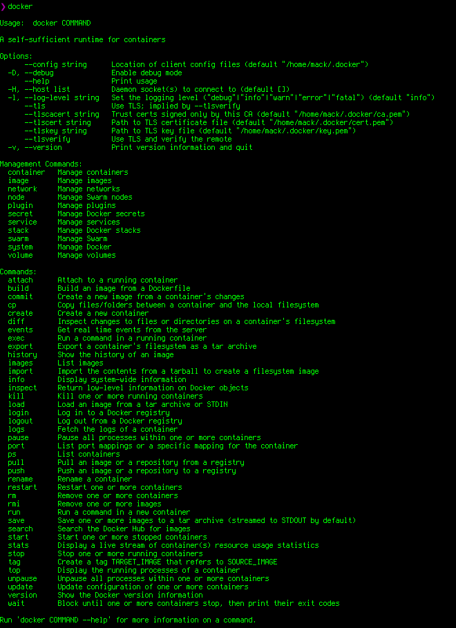
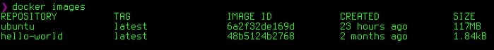
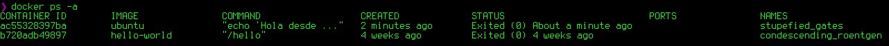

# DOCKER


- [Install Docker](https://docs.docker.com/engine/installation/)
- [Docker Hub](https://hub.docker.com/)
- [Docker ToolBox](https://www.docker.com/products/docker-toolbox)
- [Docker In Action - Libro de Docker](https://www.manning.com/books/docker-in-action)

Para la instalación de docker en cualquier versión de linux se utiliza el siguiente archivo que esta en el siguiente link
[https://get.docker.com/](https://get.docker.com/)
el cual se puede instalar de la siguiente manera

```
#
# This script is meant for quick & easy install via:
#   'curl -sSL https://get.docker.com/ | sh'
# or:
#   'wget -qO- https://get.docker.com/ | sh'
#
# For test builds (ie. release candidates):
#   'curl -fsSL https://test.docker.com/ | sh'
# or:
#   'wget -qO- https://test.docker.com/ | sh'
#
# For experimental builds:
#   'curl -fsSL https://experimental.docker.com/ | sh'
# or:
#   'wget -qO- https://experimental.docker.com/ | sh'
#
# Docker Maintainers:
#   To update this script on https://get.docker.com,
#   use hack/release.sh during a normal release,
#   or the following one-liner for script hotfixes:
#     aws s3 cp --acl public-read hack/install.sh s3://get.docker.com/index
#
```

Después de la instalación de docker se tiene que **agregar el usuario** el cual estamos usando **al grupo** que se creo cuando se instalo **docker**

```
# sudo usermod -aG docker <NOMBRE_DE_USUARIO>
```
Posterior mente se siente que deslogearse o abrir una sesión de bash nueva y ejecutar el comando

```
$ docker
```
Y se tiene que mostrar algo por el estilo...




Para saber las opciones de cada comando y ayuda de ellos
```
$ docker ps --help
```

Para saver la información del docker que tenemos instalado
```
$ docker info
$ docker version
```

Para saber que imágenes locales tenemos con docker
```
$ docker images
```




Para instalar o correr una imagen que se encuentra instalada y si no lo esta se descarga de hub.docker.com que el sitio de docker de imágenes publicas por ejemplo la imagen de **hello-world**
 - Para descargar una imagen del repositorio externo, se utiliza el comando `docker pull`
 - Cuando se ejecuta un contenedor con el comando `docker run` las imágenes son descargadas automáticamente si no se encuentran en el repositorio `local local copy is found`

```
$ docker run hello-world
```

Para instalar una imagen de manera OFICIAL de [Docker Hub](https://hub.docker.com/ "Docker Hub")
```
$ docker pull <NOMBRE_DE_IMAGEN>
```

De forma automática se descargara la ultima version **latest** que esta marcada en __tag__
Si se __requiere instalar__ una __imagen__ de __versión especifica__
```
$docker pull <NOMBRE_DE_IMAGEN:TAG_NAME>
```

__NOTA: Para buscar imagenes de docker con la linea de comandos:__

```
$ docker search <NOMBRE_DE_LA_IMAGEN>
```

ejem.
```
$ docker pull ubuntu:14:04
```

## Creando nuestro primer contenedor
 • Utilizando el comando
```
docker run
```
- El comando docker run realiza 2 acciones
    – Crea el contenedor con la imagen especificada
    – Ejecuta el contenedor
- Sintaxis
```
docker run [opciones] [imagen] [comando][args]
```

-El formato de la imagen es repository:[tag]

ejem.
```
$ docker run ubuntu echo "Hola desde Docker en ubuntu"
```

Para comprobar que se ejecuto desde la imagen de __docker ubuntu__
```
$ docker ps -a
```

tiene salida...




Si se desea saber que __imágenes__ son las que se __están ejecutando__
```
$ docker ps
```

## Listando los contenedores
- Utilizar docker `ps` para listar los contenedores
- La bandera `–a` lista todos los contenedores (inclusive aquellos que se encuentran detenidos)

## Contenedores interactivos
- Utilizar las banderas `-i` and `-t` en el comando __docker run__
- La bandera `-i` le indica a docker utilizar el STDIN del contenedor
- La bandera `-t` indica que se requiere de una pseudo terminal
- Nota: Es necesario ejecutar un proceso de terminal en el contenedor `(ej: sh /bash /zsh /etc)`

ejem...
```
$ docker run -it ubuntu bash
```
y en los procesos de docker se muestra que se esta ejecutando

__PARA SALIR DEL CONTENEDOR__
```
$ exit
```

Cada vez que se ejecuta el comando `$ docker run` se crea un contenedor __nuevo, completamente diferente__ y nos damos cuenta en el __HASH__
```
root@10c74cf79623:/#
```

Para poder entrar de nuevo al __mismo contenedor__ se tiene que poner el mismo __HASH__
```
$ docker start <CONTAINER_ID>
```

para confirmar que este correctamente levantado el contenedor se ejecuta el comando
```
$ docker ps
```

__SI Y SOLO SI__, con el contenedor levantado podemos entrar con el comando
```
# docker attach <CONTAINER_ID>
eje-
$ docker start -a -i <CONTAINER_ID>  (-a attach)
```

Cuando se ejecuta un contenedor de forma interactiva y se necesita SALIR y QUE SE SIGA EJECUTANDO, dentro del contenedor se tiene que pulsar las teclas
```
CRTL + P + Q
```

## ID de contenedores
- Los contenedores pueden referenciarse utilizando su ID de contenedor o un nombre
- ID formato reducido y extendido
- La información de puede obtener del comando `docker ps`
- Utilizar la bandera `--no-trunc` en `docker ps` para obtener el formato extendido de ID.
```
docker ps -a --no-trunc
```

#### Para poder hacer referencia a un contenedor por nombre (NO SE PUEDEN REFERENCIAR DOS CONTENEDORES CON EL MISMO NOMBRE)
```
$ docker run --name [UN_NOMBRE] ubuntu ls
```
ahora cuando ejecutando el comando `docker ps -a` aparece en la lista el `[CONTAINER_ID]` seguido por el `[NOMBRE]`

Para poder poner el mismo nombre a otro contenedor se tiene tiene que __REMOVER__ el contenedor __(PRECAUCION)__
```
$docker rm [UN_NOMBRE]
```

Para forzar la detención de un contenedor se usa
```
$ docker kill [CONTAINER_ID]
```

## Listado con filtro de contenedores con `docker ps`

- La bandera `--filter` agrega condiciones de filtrado
- Se puede filtrar basado en el código de salida y estado del contenedor
- El estado puede ser
    - Restarting
    - Running
    - Exited
    - Paused
- Para especificar múltiples condiciones utilizar la bandera --filter por cada condición
- Otros filtros: `id` `label` `name` `exited` `status` `ancestor` `isolation`
```
$docker ps --help
$ docker ps -h
```

## ELIMINAR/BORRAR IMAGENES & CONTENEDORES
SINTAXIS IMAGENES
```
$ docker rmi [OPTIONS] IMAGE [IMAGE...]
```

Name, shorthand | Default | Description
--force, -f | FALSE | Force removal of the image
--no-prune | FALSE | Do not delete untagged parents


