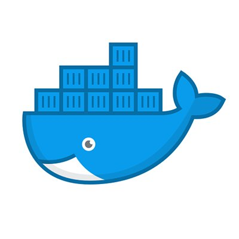
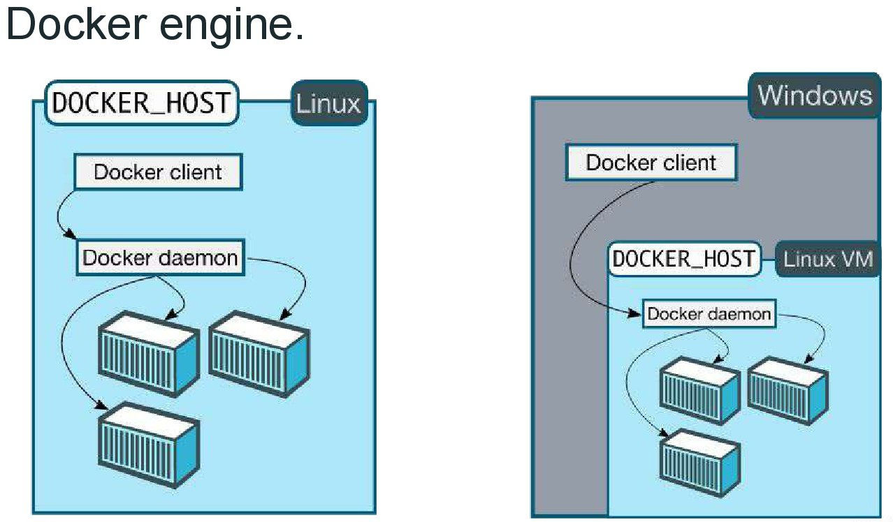
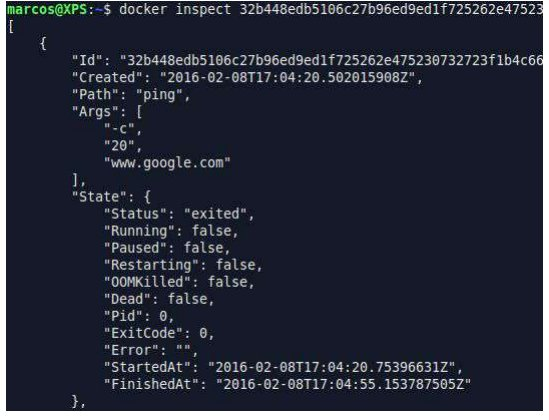

# DOCKER




- [Install Docker](https://docs.docker.com/engine/installation/)
- [Docker Hub](https://hub.docker.com/)
- [Docker ToolBox](https://www.docker.com/products/docker-toolbox)
- [Docker In Action - Libro de Docker](https://www.manning.com/books/docker-in-action)

Para la instalación de docker en cualquier versión de linux se utiliza el siguiente archivo que esta en el siguiente link
[https://get.docker.com/](https://get.docker.com/)
el cual se puede instalar de la siguiente manera

```
#
# This script is meant for quick & easy install via:
#   'curl -sSL https://get.docker.com/ | sh'
# or:
#   'wget -qO- https://get.docker.com/ | sh'
#
# For test builds (ie. release candidates):
#   'curl -fsSL https://test.docker.com/ | sh'
# or:
#   'wget -qO- https://test.docker.com/ | sh'
#
# For experimental builds:
#   'curl -fsSL https://experimental.docker.com/ | sh'
# or:
#   'wget -qO- https://experimental.docker.com/ | sh'
#
# Docker Maintainers:
#   To update this script on https://get.docker.com,
#   use hack/release.sh during a normal release,
#   or the following one-liner for script hotfixes:
#     aws s3 cp --acl public-read hack/install.sh s3://get.docker.com/index
#
```

Después de la instalación de docker se tiene que **agregar el usuario** el cual estamos usando **al grupo** que se creo cuando se instalo **docker**

```
# sudo usermod -aG docker <NOMBRE_DE_USUARIO>
```
Posterior mente se siente que deslogearse o abrir una sesión de bash nueva y ejecutar el comando

```
$ docker
```
Y se tiene que mostrar algo por el estilo...


Para saber las opciones de cada comando y ayuda de ellos
```
$ docker ps --help
```

Para saver la información del docker que tenemos instalado
```
$ docker info
$ docker version
```

## DOCKER ENGINE



## Contenedores e imagenes
+ Imagenes
    + Plantilla de sólo lectura para crear nuestros contenedores.
    + Creadas por nosotros u otros usuarios de la cumunidad.
    + Se puden guardar en registro interno o público.
+ Contendores
    + Aplicación aislada.
    + Contiene todo lo necesario para ejecutar nuestra aplicación.
    + Basados en una o más imagenes.


Para saber que imágenes locales tenemos con docker
```
$ docker images
```


## Ciclo de vida de los contenedores
• Ciclo de vida básico
    – Se crea el contenedor a partir de una imagen
    – Se ejecuta un proceso determinado en el contenedor
    – El proceso finaliza y el contenedor se detiene
    – Se destruye el contenedor
• Ciclo de vida avanzado
    – Se crea el contenedor a partir de una imagen
    – Se ejecuta un proceso determinado en el contenedor
    – Realizar acciones dentro del contenedor
    – **Detener el contenedor**
    – **Lanzar el contenedor nuevamente**


Para instalar o correr una imagen que se encuentra instalada y si no lo esta se descarga de hub.docker.com que el sitio de docker de imágenes publicas por ejemplo la imagen de **hello-world**
 - Para descargar una imagen del repositorio externo, se utiliza el comando `docker pull`
 - Cuando se ejecuta un contenedor con el comando `docker run` las imágenes son descargadas automáticamente si no se encuentran en el repositorio `local local copy is found`

```
$ docker run hello-world
```

Para instalar una imagen de manera OFICIAL de [Docker Hub](https://hub.docker.com/ "Docker Hub")
```
$ docker pull <NOMBRE_DE_IMAGEN>
```

De forma automática se descargara la ultima version **latest** que esta marcada en __tag__
Si se __requiere instalar__ una __imagen__ de __versión especifica__
```
$docker pull <NOMBRE_DE_IMAGEN:TAG_NAME>
```

__NOTA: Para buscar imagenes de docker con la linea de comandos:__

```
$ docker search <NOMBRE_DE_LA_IMAGEN>
```
ejem.
```
$ docker pull ubuntu:14:04
```
## Creando nuestro primer contenedor
 • Utilizando el comando
```
docker run
```
- El comando docker run realiza 2 acciones
    – Crea el contenedor con la imagen especificada
    – Ejecuta el contenedor
- Sintaxis
```
docker run [opciones] [imagen] [comando][args]
```

-El formato de la imagen es repository:[tag]

ejem.
```
$ docker run ubuntu echo "Hola desde Docker en ubuntu"
```

Para comprobar que se ejecuto desde la imagen de __docker ubuntu__
```
$ docker ps -a
```

tiene salida...


Si se desea saber que __imágenes__ son las que se __están ejecutando__
```
$ docker ps
```

## Listando los contenedores
- Utilizar docker `ps` para listar los contenedores
- La bandera `–a` lista todos los contenedores (inclusive aquellos que se encuentran detenidos)

## Contenedores interactivos
- Utilizar las banderas `-i` and `-t` en el comando __docker run__
- La bandera `-i` le indica a docker utilizar el STDIN del contenedor
- La bandera `-t` indica que se requiere de una pseudo terminal
- Nota: Es necesario ejecutar un proceso de terminal en el contenedor `(ej: sh /bash /zsh /etc)`

ejem...
```
$ docker run -it ubuntu bash
```
y en los procesos de docker se muestra que se esta ejecutando

__PARA SALIR DEL CONTENEDOR__
```
$ exit
```

Cada vez que se ejecuta el comando `$ docker run` se crea un contenedor __nuevo, completamente diferente__ y nos damos cuenta en el __HASH__
```
root@10c74cf79623:/#
```

Para poder entrar de nuevo al __mismo contenedor__ se tiene que poner el mismo __HASH__
```
$ docker start <CONTAINER_ID>
```

para confirmar que este correctamente levantado el contenedor se ejecuta el comando
```
$ docker ps
```

__SI Y SOLO SI__, con el contenedor levantado podemos entrar con el comando
```
# docker attach <CONTAINER_ID>
eje-
$ docker start -a -i <CONTAINER_ID>  (-a attach)
```

Cuando se ejecuta un contenedor de forma interactiva y se necesita SALIR y QUE SE SIGA EJECUTANDO, dentro del contenedor se tiene que pulsar las teclas
```
CRTL + P + Q
```

## ID de contenedores
- Los contenedores pueden referenciarse utilizando su ID de contenedor o un nombre
- ID formato reducido y extendido
- La información de puede obtener del comando `docker ps`
- Utilizar la bandera `--no-trunc` en `docker ps` para obtener el formato extendido de ID.
```
docker ps -a --no-trunc
```

#### Para poder hacer referencia a un contenedor por nombre (NO SE PUEDEN REFERENCIAR DOS CONTENEDORES CON EL MISMO NOMBRE)
```
$ docker run --name [UN_NOMBRE] ubuntu ls
```
ahora cuando ejecutando el comando `docker ps -a` aparece en la lista el `[CONTAINER_ID]` seguido por el `[NOMBRE]`

Para poder poner el mismo nombre a otro contenedor se tiene tiene que __REMOVER__ el contenedor __(PRECAUCION)__
```
$docker rm [UN_NOMBRE]
```

Para forzar la detención de un contenedor se usa
```
$ docker kill [CONTAINER_ID]
```

## Listado con filtro de contenedores con `docker ps`

- La bandera `--filter` agrega condiciones de filtrado
- Se puede filtrar basado en el código de salida y estado del contenedor
- El estado puede ser
    - Restarting
    - Running
    - Exited
    - Paused
- Para especificar múltiples condiciones utilizar la bandera --filter por cada condición
- Otros filtros: `id` `label` `name` `exited` `status` `ancestor` `isolation`
```
$docker ps --help
$ docker ps -h
```

### Eliminar/borrar imagenes & contenedores
SINTAXIS IMAGENES
```
$ docker rmi [OPTIONS] IMAGE [IMAGE...]
```

Name, shorthand | Default | Description
---------------|---------------|---------------|
--force, -f | FALSE | Force removal of the image
--no-prune | FALSE | Do not delete untagged parents


LISTAR
```
$ docker ps -a
```
ELIMINAR
```
$ docker rmi <image ó hash>
```
Eliminar imagenes que se quedan colgadas

LISTAR
```
$ docker images -f dangling=true
```
ELIMINAR
```
$ docker rmi $(docker images -f dangling=true -q)
```
Eliminar imagenes de acuerdo a algun patron

LISTAR
```
$ docker ps -a | grep "pattern"
$ docker ps -a | grep "pattern"
```
ELIMINAR
```
$ docker images | grep "pattern" | awk '{primt $1}' | xargs docker rm
```
ELiminar todas las imagenes

LISTAR
```
$ docker images -a
```
ELIMINAR
```
$ docker rmi $(docker images -a -q)
```

### Eliminar contenedores e imagenes al mismo tiempo
```
$ docker rm $(docker ps -aq) && docker rmi $(docker images -q)
```

### Sintaxis contenedores
```
$ docker rm [OPTIONS] CONTAINER [CONTAINER...]
```
Para eliminar un contenedor especifico
```
$ docker rm [ID_or_Name] [ID_or_Name]
```

Para eliminar un contenedor después de crearlo. Se crea y cuando acaba su función para la cual fue creado se elimina
```
$ docker run --rm [image_name]
```
Puede localizar contenedores utilizando `docker ps -a` y filtrarlos por su estado: `created, restarting, running, paused, o exited`. 
Para revisar la lista de contenedores salidos, utilice el indicador `-f` para filtrar en función del estado. 
Cuando haya verificado que desea eliminar esos contenedores, utilice `-q` para pasar los identificadores al comando `docker rm`

LISTAR
```
$ docker ps -a -f status=exited
```
ELIMINAR
```
$ docker rm $(docker ps -a -f status=exited -q)
```
(otra forma de filtrado)

LISTAR
```
$ docker ps -a -f status=exited -f status=created
```
ELIMINAR
```
$ docker rm $(docker ps -a -f stauts=exited -f status=created -q)
```

Eliminar contenedores dependiendo de un patron
LISTAR
```
$ docker ps -a | grep "pattern"
```

ELIMINAR
```
$ docker ps -a | grep "pattern" | awk '{print $3}' | xargs docker rmi
```

### Detener y eliminar todos los contenedores
LISTAR
```
$ docker ps -a
```
ELIMINAR
```
$ docker stop $(docker ps -a -q)
$ docker rm $(docker ps -a -q)
```

Ejemplo para hacer **ping** desde un contenedor
```
$ docker run ubuntu:14.04 ping -c 10 www.google.com
```

## Ejecutando contenedores de fondo
- Correr de fondo **(background)** o como **demonio**
- Utiliza la bandera `-b`
- Para poder ver el "output" utilizar el comando `docker logs [id contendor]/[nombre contenedor]`

Ejemplo para hacer ping desde un contenedor ejecutarlo como **demonio ó contenedor de fondo**
```
$ docker run -d ubuntu:14.04 ping -c 10 www.google.com
```

### Para ver los log de un contenedor
Se tiene que ejecutar el comando **cuando un contenedor se encuentra activo**
```
$ docker loogs [CONTAINER_ID]
```
Para poder ver en **tiempo real el log** de un contenedor se añade una bandera
```
$ docker logs -f [CONTAINER_ID]
```

## Un caso practico
- Ejecutar un servidor de aplicaciones (tomcat)
- La bandera `-P` expone los puertos utilizados por el contenedor

## Vincularse a un contenedor
- Vincularse a un contenedor, traera dicho contenedor al frente
- El output del proceso 1 será mostrado por la pantalla
- Utilizar **docker attach** y especifica el **nombre / ID** del contenedor
- **Cuidado** SÍ se preciona **CTRL+C** vinculado a un contenedor, el mismo se detendra de mandera inmediata

## Docker exec
+ docker exec habilita a ejecutar procesos adicionales dentro del contenedor.
+ Generalmente se utiliza para acceder dentro de una terminal dentro de un contenedor en ejecucion.
```
$ docker exec -i -t [CONTENEDOR_ID] [comando]
```
+ Al salir del contenedor no finaliza el contaniner.

## Acciones sobre un contenedor.
- `docker stop` y `docker kill` detienen un contenedor en ejecución.}
- `docker start` se utiliza para un contenedor en estado **STOPED** o __KILLED__.
- La bandera `-a` en `docker start` se utiliza para ejecutarse automaticamente al contenedor.

Pausa un contenedor
```
$ docker pause [CONTAINER_ID]
$ docker unpause [CONTAINER_ID]
```

## Inspeccionando un contenedor
El comando `docker inspect` se utiliza para acceder a información util de un contenedor.
```
$ docker inpect [CONTAINER_ID]
```
eje.
```
$docker inspect [CONTAINER_ID] | grep macadress
```



