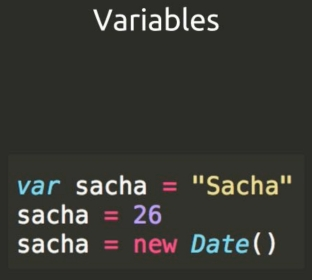
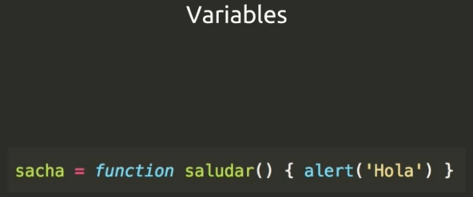
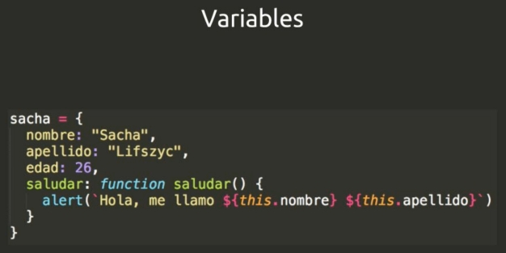
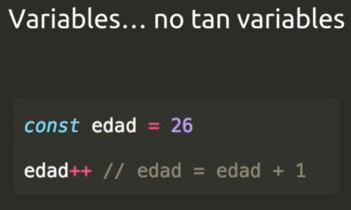
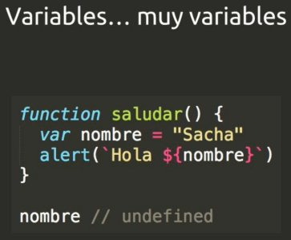
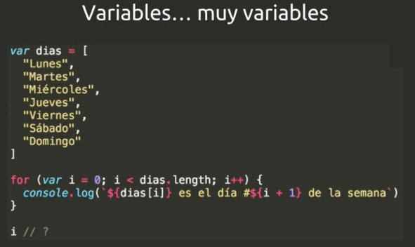
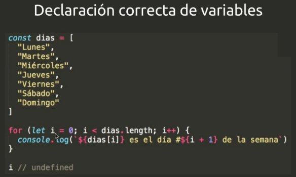

ejemplos_javascript_curso_

### Links
* :link: [The best front-end hacking cheatsheets — all in one place.](https://medium.freecodecamp.org/modern-frontend-hacking-cheatsheets-df9c2566c72a)
* :link: [ES2015+ cheatsheet A quick overview of new JavaScript features in ES2015, ES2016, ES2017 and beyond](https://devhints.io/es6)
* :link: [JavaScript Cheat Sheet - OverAPI](http://overapi.com/javascript)
* :link: [JavaScript in one page](http://www.cheat-sheets.org/sites/javascript.su/#arrayDescription)
* :link: [JavaScript Regular Expression - Cheatsheet](https://www.debuggex.com/cheatsheet/regex/javascript)
* :link: [JavaScript Event KeysCodes](http://keycode.info/)

## Estructura del lenguaje Js










```javascript
console.log("El area de un triangulo de base 5 y altura 7 es: " + 5 * 7 / 2)
console.log(`El area de un triangulo de base 5 y altura 7 es: ${5 *7 / 2}`)
```


```javascript
// CALCULAR LABASE DE UN TRIANGULO
let base = 5
let height = 7
console.log(`El area de un triangulo de base ${base} y ${height}  es: ${base * height / 2}`)
```

```javascript
// CALCULAR LABASE DE UN TRIANGULO
    let base = 5
    let height = 7
    function triangleArea(base, height){
        return base * height / 2
    }

    console.log(`El area de un triangulo de base ${base} y ${height}  es: ${triangleArea(base, height)}`)
```


```javascript
// CALCULAR LABASE DE UN TRIANGULO
let base = 5
let height = 7
let triangleArea = (base, height) => base * height / 2


console.log(`El area de un triangulo de base ${base} y ${height}  es: ${triangleArea(base, height)}`)
```


```javascript
// CALCULAR LABASE DE UN TRIANGULO
let base = 5
let height = 7
const triangleArea = (base, height) => { //ARROW FUNTIONS
    //COMENTARIO
    return base * height / 2
}

console.log(`El area de un triangulo de base ${base} y ${height}  es: ${triangleArea(base, height)}`)
```


```javascript
// RESTRICCION POR EDAD
const startWars7 = 'Start Wars: El despertar de la fuerza'
const pgStartWars7 = 13

const nameSacha = 'Sacha'
const ageSacha = 26

const nameSantiago = 'Santiago'
const ageSantiago = 12

function canWatchStartWars7(name, age, isWhitAdult = false){
    if (age >= pgStartWars7 ){
        alert(`${name} puede pasar a ver ${startWars7} `)
    } else if (isWhitAdult) {
        alert(` ${name} puede pasar a ver ${startWars7}.
         Aunque su edad es ${age}, se cuentra acompañad@ por un adulto `)
    } else {
        alert(` ${name} no puede pasar a ver ${startWars7}.
        tiene ${age} años y necesita tener ${pgStartWars7} `)
    }
}

canWatchStartWars7(nameSacha, ageSacha)
canWatchStartWars7(nameSantiago, ageSantiago, true)
```

```javascript
// RESTRICCION POR EDAD
const startWars7 = 'Start Wars: El despertar de la fuerza',
    pgStartWars7 = 13,
    nameSacha = 'Sacha',
    ageSacha = 26,
    nameSantiago = 'Santiago';
let ageSantiago = 12

const canWatchStartWars7 = (name, age, isWhitAdult = false) => {
    if (age >= pgStartWars7 ){
        alert(`${name} puede pasar a ver ${startWars7} `)
    } else if (isWhitAdult) {
        alert(` ${name} puede pasar a ver ${startWars7}.
         Aunque su edad es ${age}, se cuentra acompañad@ por un adulto `)
    } else {
        alert(` ${name} no puede pasar a ver ${startWars7}.
        tiene ${age} años y necesita tener ${pgStartWars7} `)
    }
}

canWatchStartWars7(nameSacha, ageSacha)
canWatchStartWars7(nameSantiago, ageSantiago, true)
```


```javascript
// MANEJO DE STRINGS
function platzom(str) {
    let translation = str

    //SI LA PALABRA ORIGINAL ES UN PALINDROMO
    //NINGUNA ANTERIOR CUENTA Y SE DEVUELBE LA MISMA PALABRA
    //INTERCALANDO MAYUSCULAS Y MINUSCULAS
    const reverse = (str) => str.split('').reverse().join('')

    function minMay(str){
        const length = str.length
        let translation = ''
        let capitalize = true
        for (let i = 0; i < length; i++) {
            const char = str.charAt(i)
            translation += capitalize ? char.toUpperCase() : char.toLowerCase()
            capitalize = !capitalize
        }
        return translation
    }

    if (str == reverse(str)) {
        return minMay(str)
    }

    // SI LA PALABRA TERMINA CON ar SE LE ELIMINAN 
    if (str.toLowerCase().endsWith('ar')) { //1ro CONVIERTE A MINUSCULAS, DESPUES VERIFICA QUE TERMINE CON ar
        translation = str.slice(0, -2) //SE LE QUITA LAS LETRAS ar
    }
    
    // SI LA PALABRA INICIA CON Z SE LE AÑADE AL FINAL 'pe'
    if (str.toLowerCase().startsWith('z')) {
        translation += 'pe'
    }
    
    // SI LA PALABRA TRADUCIDA TIENE MAS DE 10 LETRAS SE PARTE A LA MITAD Y SE UNE CON
    // UN GUION
    const length = translation.length
    if ( length >= 10) {
        const firtsHalf = translation.slice(0, Math.round(length / 2))
        const secondHalf = translation.slice(Math.round(length / 2))
        translation = `${firtsHalf}-${secondHalf}`
    }

    return translation
}
console.log(platzom("Programar")) // Program
console.log(platzom("Zorro")) // Zorrope
console.log(platzom("Zarpar")) // Zarpe
console.log(platzom("abecedario")) //abece-dario
console.log(platzom("sometemos")) //SoMeTeMoS
```

```javascript
// PROMEDIO CORRIDO POR SEMANA
// math.floor//rendondea hacia abajo 3.9 = 3
// math.ceil//redondea para arriba 3.1 = 4
// math.round// redondea dependiendo 3.1 = 3, 3.5 = 4

const nombre = 'rodolfo'
const dias = [
    'lunes',
    'martes',
    'miercoles',
    'jueeves',
    'viernes',
    'sabado',
    'domingo',
]

function correr(){
    const min = 5
    const max = 15
    return Math.round(Math.random() * (max - min)) + min
}

let totalKms = 0
for (let i = 0; i < dias.length; i++) {
    const kms = correr()
    totalKms += kms
    console.log(`El día ${dias[i]} ${nombre} corrio  ${kms} kms `)
}

const promedioKms = totalKms/dias.length
console.log(` En promedio ${nombre} corrio ${promedioKms.toFixed(2)} kms `)
```

```javascript
//CALCULAR GOLPES ENTRE GOKU SV SUPERMAN Y CALCULAR QUIEN GANA
let vidaGoku = 100;
let vidaSuperman = 100;

const min_power = 5;
const max_power = 12;

const ambosSiguenVivos = () => vidaGoku > 0 && vidaSuperman > 0;
const calcularGolpe = () => Math.round(Math.random() * (max_power - min_power) + min_power);
const gokuSigueVivo = () => vidaGoku > 0

let round = 0;

while(ambosSiguenVivos())
{
  round++
  console.log(`Round: ${round}`)

  const golpeGoku = calcularGolpe();
  const golpeSuperman = calcularGolpe();

  if (golpeGoku > golpeSuperman)
  {
    console.log(`Goku ataca a Superman con un golpe de ${golpeGoku}`);
    vidaSuperman -= golpeGoku;
    console.log(`Superman queda en ${vidaSuperman} puntos de vida`);
  }
  else
  {
    console.log(`Superman ataca a Goku con un golpe de ${golpeSuperman}`);
    vidaGoku -= golpeSuperman;
    console.log(`Goku queda en ${vidaGoku} puntos de vida`);
  }
}

if(gokuSigueVivo())
    {
        console.log(`Goku gano la pelea. su vida es de: ${vidaGoku}`);
    } else {
        console.log(`Superman gano la pelea. su vida es de: ${vidaSuperman}`);
    }

```

```javascript
// CALCULAR LA FECHA DE NACIMIENTO
> const nacimiento = new Date(1979, 10, 16)
> nacimiento
< Fri Nov 16 1979 00:00:00 GMT-0600 (CST)
> const hoy = new Date()
> hoy
< Sat Feb 10 2018 14:55:32 GMT-0600 (CST)
> const tiempo = hoy -nacimiento
> tiempo
< 1206716132069
> const tiempoSegundos = tiempo/1000
> tiempoSegundos
< 1206716132.069
> const tiempoMin = tiempoSegundos/60
> tiempoMin
< 20111935.534483332
> const tiempoHoras = tiempoMin/60
> tiempoHoras
< 335198.9255747222
> const proximo = new Date(hoy.getFullYear(),nacimiento.getMonth(),nacimiento.getDate())
> proximo
< Fri Nov 16 2018 00:00:00 GMT-0600 (CST)
> const diasSemana1 = [
    "Domingo",
    "Lunes",
    "Martes",
    "Miercoles",
    "Jueves",
    "Viernes",
    "Sabado",
 ]
> console.log(diasSemana1[proximo.getDay()])
  Viernes
```
```javascript
// CALCULAR LA FECHA DE NACIMIENTO
let hoy = new Date();
let diasSemana = ['Lunes','Martes','Miercoles','Jueves','Viernes','Sabado','Domingo']
const MESES = ['','Enero','Febrero','Marzo','Abril','Mayo','Junio','Julio','Agosto','Septiembre','Octubre','Noviembre', 'Diciembre',]

console.log(`Operacion realizada el dia ${hoy.getDate()} de 
            ${MESES[hoy.getMonth()]} de ${hoy.getFullYear()}`);

// Operacion realizada el dia 11 de Enero de 2018

const nacimiento = new Date(1979, 11, 16);

console.log(`Fecha de nacimiento: Dia ${nacimiento.getDate()} 
            del mes ${MESES[nacimiento.getMonth()]} del año ${nacimiento.getFullYear()}`);

// Fecha de nacimiento: Dia 16 del mes Noviembre del año 1979

const tiempo = hoy.getTime() - nacimiento.getTime();
console.log(`Tiempo ->: ${tiempo}`);

const tiempoDias = tiempo/1000/60/60/24;
console.log(`Tiempo en dias -> ${tiempoDias} `);

const tiempoAnos = Math.floor(tiempoDias/365);
console.log(`tiempoAnos -> ${tiempoAnos}`);

const tiempoMeses = Math.floor((tiempoDias - (tiempoAnos * 365)) /31);
console.log(`tiempoMeses -> ${tiempoMeses}`);

const dias = Math.floor(tiempoDias - (tiempoAnos * 365) - (tiempoMeses * 31));
console.log(`dias -> ${dias}`);

console.log(`Han pasado ${tiempoDias} años ${tiempoMeses} meses dias ${dias} desde mi nacimiento`)
// Han pasado 13937.549797256945 años 2 meses dias 5 desde mi nacimiento

```

```javascript
// DISTANCIA ENTRE DOS PUNTOS
const p1 = {
    x: 0,
    y: 4
}

const p2 = {
    x: 3,
    y: 0
}

function distancia(p1, p2){
    const x = p1.x - p2.x
    const y = p1.y - p2.y
    
    return Math.sqrt(x * x + y * y)
}

console.log(distancia(p1,p2))
// console.log(distancia(p1,x: 20, y: -7))

```

```javascript
// DISTANCIA ENTRE DOS PUNTOS

const p1 = {
    x: 0,
    y: 4,
    moverEnX(x){ // HACE LA MISMA FUNCIONQUE PARA P2
        this.x += x
    },
    moverEnX(y){ // HACE LA MISMA FUNCIONQUE PARA P2
        this.y += y
    }
}

const p2 = {
    x: 3,
    y: 0,
    moverEnX: function (x) { this.x += x }, // SE HACE REFERENCIA AL VALOR DE x QUE VALE 3
    moverEnY: function (y) { this.y += y }, // SE HACE REFERENCIA AL VALOR DE Y QUE VALE 0
}

function distancia(p1, p2){
    const x = p1.x - p2.x
    const y = p1.y - p2.y
    
    return Math.sqrt(x * x + y * y).toFixed(2)
}
// PARA MOVER CUALQUIERA DE LOS PUNTOS -> `p2.moverEnX(3)`
console.log(distancia(p1,p2))
```

```javascript
// DEFINIR LA CLASE/PROTOTIPO "Punto"

function Punto(x, y){ //PROPOTIPO
    this.x = x // CONSTRUCTOR
    this.y = y
}

// SE AGREGAN METODOS AL PROTOTIPO
Punto.prototype.moverEnX = function moverEnX (x){
    this.x += x
}

Punto.prototype.moverEnY = function moverEnY (y){
    this.y += y
}

Punto.prototype.distancia = function distancia(p){
    const x = this.x - p.x
    const y = this.y - p.y

    return Math.sqrt(x * x + y * y).toFixed(2)
}


const p1 = new Punto(0, 4) // SE CREA UN NUEVO OBJETO
const p2 = new Punto(3, 0) // SE CREA UN NUEVO OBJETO

console.log(p1.distancia(p2))
console.log(p2.distancia(p1))
p1.moverEnX(10)
console.log(p1.distancia(p2))
p2.moverEnY(-4)
console.log(p1.distancia(p2))
```

```javascript
// function Punto(x, y){ //PROPOTIPO
//     this.x = x // CONSTRUCTOR
//     this.y = y
// }
// 
// // SE AGREGAN METODOS AL PROTOTIPO
// Punto.prototype.moverEnX = function moverEnX (x){
//     this.x += x
// }
// 
// Punto.prototype.moverEnY = function moverEnY (y){
//     this.y += y
// }
// 
// Punto.prototype.distancia = function distancia(p){
//     const x = this.x - p.x
//     const y = this.y - p.y
// 
//     return Math.sqrt(x * x + y * y).toFixed(2)
// }

// DEFINIR LA CLASE/PROTOTIPO "Punto" - Object.create
const Punto = {
    init: function(x, y){
        this.x = x
        this.y = y

    },
    moverEnX: function moverEnX(x){
        this.x += x
    },
    moverEnY: function moverEnY(y){
        this.y += y
    },
    distancia: function distancia(p){
        const x = this.x - p.x
        const y = this.y - p.y

        return Math.sqrt(x * x + y * y).toFixed(2)
    }

}

const p1 = Object.create(Punto)
const p2 = Object.create(Punto)
p1.init(0, 4)
p2.init(3, 0)

console.log(p1.distancia(p2))
console.log(p2.distancia(p1))
p1.moverEnX(10)
console.log(p1.distancia(p2))
p2.moverEnY(-4)
console.log(p1.distancia(p2))
```

```javascript
// DEFINIR LA CLASE/PROTOTIPO "Punto" - Class de Javascript
class Punto{ // SE CREA UN NUEVO OBJETO DE TIPO PUNTO
    constructor(x, y){ // DICE QUE ES CLASE PERO FUNCIONA COMO PROTOTIPO
        this.x = x
        this.y = y
    }

    moverEnX (x) { // METODOS NO ES NECESARIO EL KEYWORD "function"
        this.x += x
    }

    moverEnY (y) {
        this.y += y
    }

    distancia(p) {
        const x = this.x - p.x
        const y = this.y - p.y

        return Math.sqrt(x * x + y * y).toFixed(2)
    }
}

const p1 = new Punto(0, 4) // SE CREA UN NUEVO OBJETO
const p2 = new Punto(3, 0) // SE CREA UN NUEVO OBJETO

console.log(p1.distancia(p2))
console.log(p2.distancia(p1))
p1.moverEnX(10)
console.log(p1.distancia(p2))
p2.moverEnY(-4)
console.log(p1.distancia(p2))

```

```javascript

var nombre = "Sacha"

function saludar10() {
  var nombre
  if (true) {
     nombre = "Eric"
  }
  
  console.log(`Hola ${nombre}`)
}

saludar("Sacha")
console.log(`La variable nombre tiene el valor ${nombre}`)


function saludarASacha10() {
  const nombre = "Sacha"

  for (let i = 0; i < 10; i++) {
    console.log(`Hola ${nombre}`)
  }
}

saludarASacha10()

```

```javascript
// EJEMPLO OPERADOR Spread (...)

var a, b, c, d, e;  
a = [1,2,3];  
b = "dog";  
c = [42, "cat"];  
  
// Using the concat method.  
d = a.concat(b, c);  
  
// Using the spread operator.  
e = [...a, b, ...c];  
  
console.log(d);  
console.log(e);  
  
// Output:  
// 1, 2, 3, "dog", 42, "cat"  
// 1, 2, 3, "dog", 42, "cat" 


```


```javascript
// OPERACIONES CON METODOS DE ARRAYS

function suma(...numeros) {
  return numeros.reduce(function (acum, numero) {
    acum += numero
    return acum
  }, 0) // <- ES EL VALOR INICIAL DEL ACOMULADOR
}

const dobles = (...numeros) => numeros.map(numero => numero * 2)

const pares = (...numeros) => numeros.filter(numero => numero % 2 == 0)

```
* :link: - [reduce](https://developer.mozilla.org/es/docs/Web/JavaScript/Referencia/Objetos_globales/Array/reduce)
* :link: - [push](https://developer.mozilla.org/es/docs/Web/JavaScript/Referencia/Objetos_globales/Array/push)
* :link: - [filter](https://developer.mozilla.org/es/docs/Web/JavaScript/Referencia/Objetos_globales/Array/filter)
* :link: - [map](https://developer.mozilla.org/en-US/docs/Web/JavaScript/Reference/Global_Objects/Array/map)
* :link: - [sort](https://developer.mozilla.org/en-US/docs/Web/JavaScript/Reference/Global_Objects/Array/sort)

```javascript
// CLOSURES JAVASCRIPT
function saludarFamilia(apellido) {
  return function saludarMiembroDeFamilia(nombre) {
    console.log(`Hola ${nombre} ${apellido}`)
  }
}

const saludarGomez = saludarFamilia("Gomez")
const saludarPerez = saludarFamilia("Perez")
const saludarRomero = saludarFamilia("Romero")

saludarGomez("Pedro")
saludarGomez("Juan")
saludarGomez("Laura")
saludarGomez("Mónica")

saludarPerez("Dario")
saludarPerez("Martin")
saludarPerez("Julieta")

saludarRomero("Jorge")

```

```javascript
// CLOSURES JAVASCRIPT EJEMPLO 2
function makePrefixer(antes) {
  return function palabra(palabra) {
    console.log(`${antes}${palabra}`)
  }
}

const prefijoRe = makePrefixer("re")

makePrefixer("bueno")

// rebueno
```

### EJEMPLO QUE AL PRECIONAR LAS TECLAS SE ACTIVA UN SONIDO Y SE MUESTRA EN HTML Y CSS QUE TECLA SE PRECIONO
```javascript

<!DOCTYPE html>
<html lang="en">
<head>
  <meta charset="UTF-8">
  <title>JS Drum Kit</title>
  <link rel="stylesheet" href="style.css">
</head>
<body>


  <div class="keys">
    <div data-key="65" class="key">
      <kbd>A</kbd>
      <span class="sound">clap</span>
    </div>
    <div data-key="83" class="key">
      <kbd>S</kbd>
      <span class="sound">hihat</span>
    </div>
    <div data-key="68" class="key">
      <kbd>D</kbd>
      <span class="sound">kick</span>
    </div>
    <div data-key="70" class="key">
      <kbd>F</kbd>
      <span class="sound">openhat</span>
    </div>
    <div data-key="71" class="key">
      <kbd>G</kbd>
      <span class="sound">boom</span>
    </div>
    <div data-key="72" class="key">
      <kbd>H</kbd>
      <span class="sound">ride</span>
    </div>
    <div data-key="74" class="key">
      <kbd>J</kbd>
      <span class="sound">snare</span>
    </div>
    <div data-key="75" class="key">
      <kbd>K</kbd>
      <span class="sound">tom</span>
    </div>
    <div data-key="76" class="key">
      <kbd>L</kbd>
      <span class="sound">tink</span>
    </div>
  </div>

  <audio data-key="65" src="sounds/clap.wav"></audio>
  <audio data-key="83" src="sounds/hihat.wav"></audio>
  <audio data-key="68" src="sounds/kick.wav"></audio>
  <audio data-key="70" src="sounds/openhat.wav"></audio>
  <audio data-key="71" src="sounds/boom.wav"></audio>
  <audio data-key="72" src="sounds/ride.wav"></audio>
  <audio data-key="74" src="sounds/snare.wav"></audio>
  <audio data-key="75" src="sounds/tom.wav"></audio>
  <audio data-key="76" src="sounds/tink.wav"></audio>

<script>
  function playSound(e) {
  //console.log(e.keyCode); // SE CAPTURA EL CODIGO DE LA TECLA PRESIONADA 65
  // BUSCAR EL AUDIO DEPENDIENDO DE LA TECLA PRECIONADA
  const audio = document.querySelector(`audio[data-key="${e.keyCode}"]`);
  const key = document.querySelector(`.key[data-key="${e.keyCode}"]`);
  //console.log(audio); // <audio data-key="83" src="sounds/hihat.wav"></audio>
  if (!audio) return; // SI NO SE ENCUENTRA LA TECLA SE PARA LA FUNCION
  // console.log(audio.currentTime);
  audio.play();
  audio.currentTime = 0; // REGRESAR AL INICIO DEL AUDIO PARA REPETIRLO
  //console.log(key)
  key.classList.add('playing'); // SE AÑADE LA CLASE "playing"
};

  function removeTransition(e){
    // console.log(e);
    // SE SALTA SI NO ES 'transform'
    if (e.propertyName !== 'transform') return; // EN CSS EN EL EVENTO "TransitionEvent" SE BUSCA LA PROPIEDAD "propertyName"
    // console.log(e.propertyName);
    // console.log(this); // <div data-key="65" class="key playing"> // PROVIENEN DE key DEL VALOR DE keys
    this.classList.remove('playing'); // SE REMUEVE LA CLASE 'playing'
  }

  const keys = document.querySelectorAll('.key'); // REGRESA NODO DE TECLAS OCUPADAS 
  keys.forEach(key => key.addEventListener('transitionend', removeTransition));
  // console.log(keys);
  window.addEventListener('keydown', playSound); // EN LA VENTANA WINDOWS SE BUSCA EL EVENTO TECLA Y SE ALAMACENA EN EL EVENTO(e) DE LA FUNCION
</script>


</body>
</html>


```

### EJEMPLO PARA HACER UN RELOG CON MANESILLAS
```javascript

<!DOCTYPE html>
<html lang="en">
<head>
  <meta charset="UTF-8">
  <title>JS + CSS Clock</title>
</head>
<body>


    <div class="clock">
      <div class="clock-face">
        <div class="hand hour-hand"></div>
        <div class="hand min-hand"></div>
        <div class="hand second-hand"></div>
      </div>
    </div>


  <style>
    html {
      background:#018DED url(http://unsplash.it/1500/1000?image=881&blur=50);
      background-size:cover;
      font-family:'helvetica neue';
      text-align: center;
      font-size: 10px;
    }

    body {
      margin: 0;
      font-size: 2rem;
      display:flex;
      flex:1;
      min-height: 100vh;
      align-items: center;
    }

    .clock {
      width: 30rem;
      height: 30rem;
      border:20px solid white;
      border-radius:50%;
      margin:50px auto;
      position: relative;
      padding:2rem;
      box-shadow:
        0 0 0 4px rgba(0,0,0,0.1),
        inset 0 0 0 3px #EFEFEF,
        inset 0 0 10px black,
        0 0 10px rgba(0,0,0,0.2);
    }

    .clock-face {
      position: relative;
      width: 100%;
      height: 100%;
      transform: translateY(-3px); /* account for the height of the clock hands */
    }

    .hand {
      width:50%;
      height:6px;
      background:black;
      position: absolute;
      top:50%;
      /*ESTILOS MODIFICADOS*/
      transform-origin: 100%;
      transform: rotate(90deg);
      transition: all 0.05s;
      transition-timing-function: cubic-bezier(0.33, 3.46, 0.58, 1);
    }

  </style>

  <script>
  // SE SELECCIONA LA MANESILLA SOLO DE SEGUNDOS POR LA CLASE
  const secondHand = document.querySelector('.second-hand');
  const minsHand = document.querySelector('.min-hand');
  const hourHand = document.querySelector('.hour-hand');

  function setDate(){
    const now = new Date();
    const seconds = now.getSeconds();
    const secondsDegrees = ((seconds / 60) * 360) + 90;
    secondHand.style.transform = `rotate(${secondsDegrees}deg)`;

    const mins = now.getMinutes();
    const minsDegrees = ((mins / 60) * 360) + 90;
    minsHand.style.transform = `rotate(${minsDegrees}deg)`;
    
    const hours = now.getHours();
    const hoursDegrees = ((hours / 12) * 360) + 90;
    hourHand.style.transform = `rotate(${hoursDegrees}deg)`;

    console.log(`${hours} - ${secondsDegrees} - ${minsDegrees}`);
  }

  setInterval(setDate, 1000);

  </script>
</body>
</html>


```
### EJEMPLO DE REDUCE, PUSH, MAP, FILTER
```javascript

<!DOCTYPE html>
<html lang="en">
<head>
  <meta charset="UTF-8">
  <title>Array Cardio 💪</title>
</head>
<body>
  <p><em>Psst: have a look at the JavaScript Console</em> 💁</p>
  <script>
    // Get your shorts on - this is an array workout!
    // ## Array Cardio Day 1

    // Some data we can work with

    const inventors = [
      { first: 'Albert', last: 'Einstein', year: 1879, passed: 1955 },
      { first: 'Isaac', last: 'Newton', year: 1643, passed: 1727 },
      { first: 'Galileo', last: 'Galilei', year: 1564, passed: 1642 },
      { first: 'Marie', last: 'Curie', year: 1867, passed: 1934 },
      { first: 'Johannes', last: 'Kepler', year: 1571, passed: 1630 },
      { first: 'Nicolaus', last: 'Copernicus', year: 1473, passed: 1543 },
      { first: 'Max', last: 'Planck', year: 1858, passed: 1947 },
      { first: 'Katherine', last: 'Blodgett', year: 1898, passed: 1979 },
      { first: 'Ada', last: 'Lovelace', year: 1815, passed: 1852 },
      { first: 'Sarah E.', last: 'Goode', year: 1855, passed: 1905 },
      { first: 'Lise', last: 'Meitner', year: 1878, passed: 1968 },
      { first: 'Hanna', last: 'Hammarström', year: 1829, passed: 1909 }
    ];

    const people = ['Beck, Glenn', 'Becker, Carl', 'Beckett, Samuel', 'Beddoes, Mick', 'Beecher, Henry', 'Beethoven, Ludwig', 'Begin, Menachem', 'Belloc, Hilaire', 'Bellow, Saul', 'Benchley, Robert', 'Benenson, Peter', 'Ben-Gurion, David', 'Benjamin, Walter', 'Benn, Tony', 'Bennington, Chester', 'Benson, Leana', 'Bent, Silas', 'Bentsen, Lloyd', 'Berger, Ric', 'Bergman, Ingmar', 'Berio, Luciano', 'Berle, Milton', 'Berlin, Irving', 'Berne, Eric', 'Bernhard, Sandra', 'Berra, Yogi', 'Berry, Halle', 'Berry, Wendell', 'Bethea, Erin', 'Bevan, Aneurin', 'Bevel, Ken', 'Biden, Joseph', 'Bierce, Ambrose', 'Biko, Steve', 'Billings, Josh', 'Biondo, Frank', 'Birrell, Augustine', 'Black, Elk', 'Blair, Robert', 'Blair, Tony', 'Blake, William'];

    // Array.prototype.filter()
    // 1. Filter the list of inventors for those who were born in the 1500's
    
    //const fifteen = inventors.filter(function(inventors){
    /*const fifteen = inventors.filter(inventors => {
      if (inventors.year >=1500 && inventors.year <=1600) {
        return true; // NOS QUEDAMOS CON EL VALOR - Return true to keep the element, false otherwise, taking three arguments:
      }

    });*/
    let fifteen = inventors.filter(inventors => (inventors.year >=1500 && inventors.year <=1600))
    console.table(fifteen);

    // Array.prototype.map()
    // 2. Give us an array of the inventors' first and last names

        let fullNames = inventors.map(inventors => (`${inventors.first} ${inventors.last}`))
        console.table(fullNames);

    // Array.prototype.sort()
    // 3. Sort the inventors by birthdate, oldest to youngest

        // 1RA FORMA
        // inventors.sort(function(a, b) {
        //     console.log(`a -> ${a.year} - b -> ${b.year}`);
        //     return a.year - b.year;
        // });
        // console.table(inventors);

        // 2DA FORMA
        let ordered = inventors.sort((a, b) => (a.year > b.year ? 1 : -1))
        console.table(ordered);


    // Array.prototype.reduce()
    // 4. How many years did all the inventors live?

        let totalYears = inventors.reduce((acomuladorTotal, inventors) => {
            return acomuladorTotal + (inventors.passed - inventors.year)
        }, 0); // SE INICIALISA A CERO LA VARIALE 'acomuladorTotal' O SE PUEDE DECLARAR ANTES CON CERO
        console.log(totalYears);

    // 5. Sort the inventors by years lived

        let masBiejo = inventors.sort(function(a, b){
            let primerPersona = a.passed - a.year;
            let segundaPersona = b.passed - b.year;
                return segundaPersona < primerPersona ? 1 : -1; //SE CAMBIA EL SIGNO PARA SORTEAR DE MAYOR A MENOR
        });
        console.table(masBiejo);


    // 6. create a list of Boulevards in Paris that contain 'de' anywhere in the name
    // https://en.wikipedia.org/wiki/Category:Boulevards_in_Paris

        let category = document.querySelector('.mw-category'); //SE BUSCA DENTRO DE VARIABLE QUE GUARDO ELEMENTOS DEL DOM
        // let links = category.querySelectorAll('a'); // TOMA LOS VALORES DEL DOM COMO UN NODO
        // let links = Array.from(category.querySelectorAll('a')); // SE CONVIERTEN EL NODO EN ARRAY
        let links = [...category.querySelectorAll('a')]; // SE CONVIERTEN EL NODO EN ARRAY CON EL OPERADO SPREAD

        let de = links
                    .map(links => links.textContent) // POR EL METODO map SE OBTIENE UN ARRAY PARA SACAR EL PARAMETRO DE LA VARIABLE OBJETO links
                    .filter(streetName => streetName.includes('de'));

    // 7. sort Exercise
    // Sort the people alphabetically by last name

    // 8. Reduce Exercise
    // Sum up the instances of each of these
    const data = ['car', 'car', 'truck', 'truck', 'bike', 'walk', 'car', 'van', 'bike', 'walk', 'car', 'van', 'car', 'truck' ];

  </script>
</body>
</html>


```


